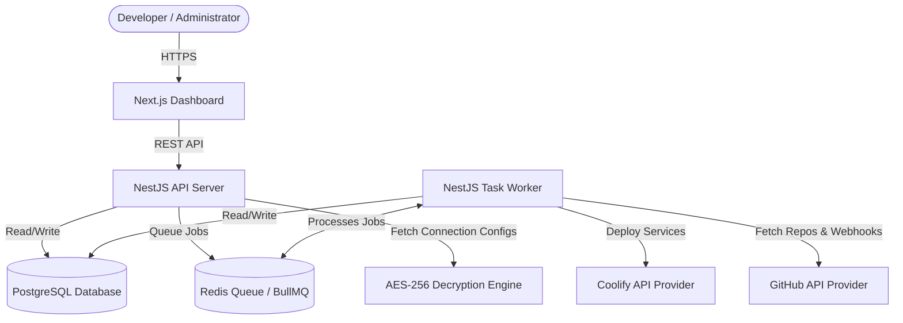

# 🚀 HALLO Projects

An open-source, self-hosted Platform-as-a-Service (PaaS) engine designed to simplify service deployments, repository synchronization, and server orchestration. Built with a modern, high-performance TypeScript monorepo architecture, HALLO Projects acts as a control center for managing your web applications, git connections, environment variables, and remote infrastructure.

---

## 🏛️ Architecture & System Design

HALLO Projects utilizes a modular monorepo system composed of a frontend dashboard, a REST API server, and a background task worker powered by Redis and BullMQ.



---

## ✨ Core Features

- **🌐 Centralized Service Management**: Group deployments by Projects and Environments (Production, Staging, Development).
- **🐙 GitHub Integration**: Connect repository accounts using Personal Access Tokens (PAT), automatically register webhook listeners, and deploy specific branches on git push.
- **☁️ Coolify Provider Integration**: Orchestrate remote servers and Docker environments through Coolify's API.
- **🔄 Deployment Engine**:
  - Live deployment log streaming.
  - Multi-stage build queue handling (Pending, Building, Deploying, Success, Failed).
  - Cancel active/pending deployments directly from the dashboard UI.
- **🔑 Secure Environment Variables**:
  - Automatically encrypts all environment variables at rest using AES-256-GCM.
  - Strict masking of secret variables (`isSecret: true`) returning `***` in API payloads.
- **📋 Audit Logging**: Complete visibility with comprehensive user activity history tracking.

---

## 🛠️ Technology Stack

- **Monorepo Management**: [PNPM Workspaces](https://pnpm.io/workspaces) & [Turborepo](https://turbo.build/)
- **Frontend Dashboard**: [Next.js 14](https://nextjs.org/) (App Router), Tailwind CSS, Shadcn UI, Zustand, TanStack Query.
- **Backend Service**: [NestJS](https://nestjs.com/) (Modular architecture, Guards, Interceptors).
- **Database Access**: [Prisma ORM](https://www.prisma.io/) with a [PostgreSQL](https://www.postgresql.org/) database.
- **Job Orchestration**: [BullMQ](https://bullmq.io/) with [Redis](https://redis.io/) for high-throughput background processing.
- **Documentation Engine**: [Docusaurus 3](https://docusaurus.io/) serving premium guide pages.

---

## 📂 Project Directory Structure

```
.
├── apps/
│   ├── api/          # NestJS REST API Gateway
│   ├── docs/         # Docusaurus documentation website
│   ├── web/          # Next.js 14 client dashboard
│   └── worker/       # NestJS BullMQ processor for background tasks
├── packages/
│   ├── sdk/          # Unified HALLO PaaS SDK interfaces
│   ├── shared/       # Shared TypeScript constants, schemas, and helpers
│   └── ui/           # Shared Tailwind/React component library
├── providers/
│   ├── coolify/      # Coolify API client implementation
│   └── github/       # GitHub Repository & Hook client implementation
├── docker/
│   ├── Dockerfile.*  # Docker build configurations
│   ├── docker-compose.yml # Dev/Prod container infrastructure orchestration
│   └── Caddyfile     # Web routing and reverse proxy configs
└── TECHNICAL_DOCUMENTATION.md # Comprehensive roadmap and schema specifications
```

---

## 🚀 Getting Started

### Prerequisites

Ensure you have the following installed on your machine:

- [Node.js](https://nodejs.org/) (v22.0.0 or higher)
- [PNPM](https://pnpm.io/) (v9.0.0 or higher)
- [Docker](https://www.docker.com/) & Docker Compose
- Running instances of **PostgreSQL** and **Redis**

### Setup Instructions

1. **Clone the Repository**:

   ```bash
   git clone https://github.com/hallolabs/hallo-projects.git
   cd hallo-projects
   ```

2. **Configure Environment Variables**:
   Copy the example environment files for the root workspace and apps:

   ```bash
   cp .env.example .env
   cp apps/api/.env.example apps/api/.env
   cp apps/web/.env.example apps/web/.env
   ```

3. **Install Dependencies**:

   ```bash
   pnpm install
   ```

4. **Initialize Database Schema**:
   Run the Prisma database migrations to set up Postgres:

   ```bash
   pnpm --filter @hallo/api prisma migrate dev
   ```

5. **Start Dev Servers**:
   Run the monorepo applications concurrently:
   ```bash
   pnpm dev
   ```
   This will spin up:
   - **Frontend Dashboard**: `http://localhost:3000`
   - **REST API Server**: `http://localhost:4000`
   - **Queue Task Worker**: Background daemon
   - **Documentation Site**: `http://localhost:3001`

---

## 🐳 Deployment (VPS Production)

A production-ready stack is defined in the `docker` directory. You can deploy it using Docker Compose:

```bash
docker compose -f docker/docker-compose.yml up -d
```

### Routing Setup

The Caddy configuration manages sub-domains routing:

- `app.{$DOMAIN}` -> Routes to the Next.js Dashboard.
- `api.{$DOMAIN}` -> Routes to the NestJS API.
- `docs.{$DOMAIN}` -> Routes to the Docusaurus Site.

---

## 📄 License

This project is licensed under the MIT License - see the [LICENSE](LICENSE) file for details.
