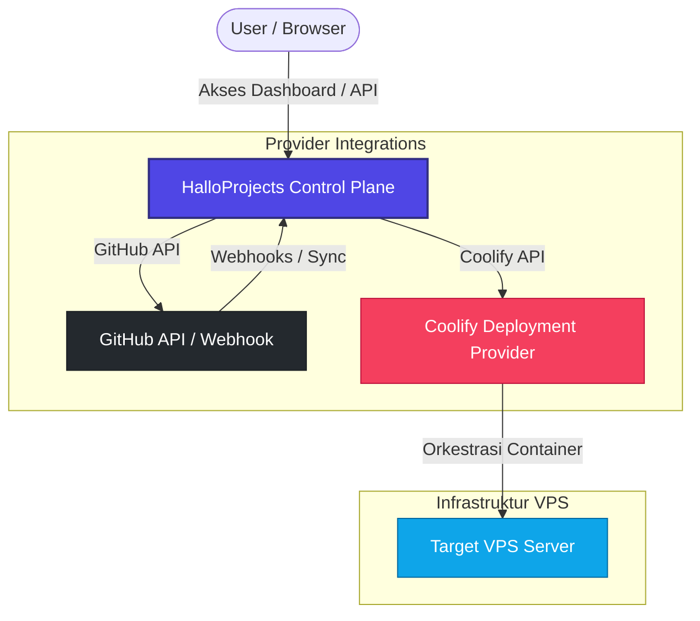

<p align="center">
  <picture>
    <source media="(prefers-color-scheme: dark)" srcset="logo-dark.svg">
    <source media="(prefers-color-scheme: light)" srcset="logo-light.svg">
    
  </picture>
</p>

<h1 align="center">HALLO Projects</h1>

<p align="center">
  <strong>Project Control Plane open-source & self-hosted untuk menyatukan seluruh aktivitas project dari repository hingga production dalam satu dashboard terpusat.</strong>
</p>

<p align="center">
  <a href="https://github.com/HalloLabsOrg/HalloProjects/actions/workflows/ci.yml"></a>
  <a href="LICENSE"></a>
  <a href="https://github.com/HalloLabsOrg/HalloProjects/releases"></a>
</p>

---

## 🌟 Apa itu HALLO Projects?

**HALLO Projects** adalah **Project Control Plane** open-source yang dirancang agar dapat dijalankan secara mandiri (self-hosted). Tujuannya bukanlah untuk menggantikan platform deployment/PaaS (seperti Coolify) atau repositori (seperti GitHub), melainkan bertindak sebagai **lapisan kontrol (control plane)** terpusat yang menyatukan seluruh siklus hidup pengembangan aplikasi Anda.

Dengan antarmuka dashboard yang bersih dan alur kerja terpusat, Anda dapat mengelola repositori, melacak status deployment, mengonfigurasi variabel lingkungan yang aman (AES-256-GCM), mengakses logs, serta memantau kesehatan service (health check) tanpa perlu berpindah-pindah antar-layanan (seperti GitHub, Coolify, dan VPS).

---

## ⚖️ Perbandingan & Peran HalloProjects

### Apa yang Membedakan HalloProjects dengan Produk Lain?
Tidak seperti platform PaaS konvensional yang bertindak langsung sebagai *deployment engine* lokal, **HalloProjects** diposisikan sebagai **Control Plane / Orchestration Layer**. 

Berikut adalah perbandingan karakteristik utama:

| Karakteristik | HalloProjects | Coolify / CapRover | Vercel / Heroku |
| :--- | :--- | :--- | :--- |
| **Kategori** | Control Plane / Orchestrator | Deployment Engine (Self-Hosted) | Closed SaaS PaaS |
| **Tujuan Utama** | Menyatukan repo & deployment engine dalam satu dashboard project terpadu | Membangun & menjalankan kontainer Docker langsung di server VPS | Hosting kode instan di server proprietary mereka |
| **Model Integrasi** | Menghubungkan API pihak ketiga (GitHub, Coolify, dll.) | Bertindak sebagai host server target langsung | Mengelola infrastruktur cloud proprietary tertutup |
| **Multi-Server Control** | Ya, satu kontrol panel terpusat untuk mengelola banyak instansi deployment | Terbatas pada server lokal atau cluster bentukan engine sendiri | Ya, dikelola penuh oleh provider SaaS |
| **Fleksibilitas Infra** | Sangat Tinggi (Bisa menggunakan provider deployment apa saja melalui SDK) | Sedang (Terkunci pada manajemen Docker/Nixpacks lokal) | Rendah (Ketergantungan penuh pada platform SaaS) |

---

### Skema Peran HalloProjects
HalloProjects bertindak sebagai jembatan orkestrasi antara Repositori Kode dan Deployment Engine. Pengguna tidak perlu mengakses VPS secara langsung; cukup berinteraksi melalui dashboard HalloProjects:



---

## 🎯 Skenario Solusi

HALLO Projects memecahkan masalah manajemen server tradisional melalui beberapa skenario praktis:

### 1. Konsolidasi Aplikasi pada Satu VPS (Server Cost Efficiency)

- **Masalah:** Mengelola banyak aplikasi (Frontend, API, Worker, Database) di satu server sering kali rumit karena konflik port, konfigurasi reverse proxy manual, dan overhead resource.
- **Solusi:** HALLO Projects mengisolasi setiap service menggunakan container Docker secara otomatis dan mengaturnya di balik Caddy Reverse Proxy. Semua service dapat berbagi resource server yang sama secara aman dengan routing sub-domain otomatis.

### 2. Auto-Deployment Berbasis Git (Push-to-Deploy)

- **Masalah:** Mengatur pipeline CI/CD manual (GitHub Actions, GitLab CI) membutuhkan konfigurasi SSH key, runner, dan script bash yang rumit di setiap project.
- **Solusi:** Cukup hubungkan repositori GitHub Anda menggunakan Personal Access Token (PAT). HALLO Projects akan mendaftarkan webhook otomatis. Setiap kali Anda melakukan `git push` ke branch yang ditentukan, server akan melakukan pull, build, dan deploy versi terbaru secara langsung.

### 3. Keamanan Variabel Lingkungan & Secret (Secret Protection)

- **Masalah:** Menaruh file `.env` di server rentan bocor, dan menampilkannya secara polos di dashboard admin berisiko tinggi.
- **Solusi:** Semua environment variables dienkripsi di database menggunakan algoritma AES-256-GCM. Untuk variabel bertipe _Secret_, nilainya secara otomatis disamarkan (`***`) di API dan dashboard.

### 4. Kontrol dan Pemantauan Deployment (Orchestration & Logs)

- **Masalah:** Sulit melacak status deployment yang sedang berjalan atau menghentikan proses build yang salah arah tanpa mengakses terminal server via SSH.
- **Solusi:** Dashboard menampilkan status deployment (Pending, Building, Deploying, Success, Failed) secara real-time disertai log build langsung. Operator juga dapat membatalkan proses deployment yang sedang berjalan hanya dengan satu klik tombol "Cancel".

---

## 🚀 Panduan Instalasi (VPS Production)

Kami menyediakan skrip installer satu baris untuk memasang HALLO Projects di server berbasis Linux (Ubuntu 22.04+ / Debian 12+) secara otomatis.

### Cara Cepat (Automated Installation)

Jalankan perintah berikut di server VPS Anda:

```bash
curl -fsSL https://raw.githubusercontent.com/HalloLabsOrg/HalloProjects/main/install.sh | bash
```

Skrip ini akan secara otomatis:
1. Memverifikasi persyaratan sistem (`Docker`, `Git`, `Curl`).
2. Menanyakan domain Anda dan konfigurasi awal admin.
3. Membuat environment `.env` dengan password database & JWT secrets acak yang aman.
4. Menarik file, mem-build, dan menyalakan seluruh service container Docker.
5. Menjalankan migrasi database serta mengunggah template bawaan.

### Memperbarui Platform (Update)

Untuk melakukan update ke versi terbaru, masuk ke folder instalasi dan jalankan script update:

```bash
./update.sh
```

---

## 🛠️ Langkah Awal Penggunaan

1. **Akses Dashboard**: Setelah instalasi selesai, buka browser Anda menuju domain yang Anda masukkan (misal: `http://domain-anda.com`).
2. **Kredensial Default**: Masuk menggunakan email admin dan password yang Anda konfigurasi di awal pemasangan.
3. **Hubungkan GitHub Provider**: Masuk ke menu **Providers**, tambahkan koneksi GitHub baru dengan memasukkan Personal Access Token (PAT) klasik Anda.
4. **Buat Project Baru**: Masuk ke menu **Projects**, buat workspace project baru dan hubungkan repositori Git Anda untuk memulai deployment pertama.

---

## 📖 Dokumentasi Lengkap
Dokumentasi lengkap, panduan konfigurasi variabel, modul reference, skema pembuatan template kustom, dan panduan kontributor dapat diakses melalui server dokumentasi terintegrasi:
* Server Docs: `http://docs.domain-anda.com` (atau `http://localhost:3001` di lingkungan pengembangan lokal).

---

## 📄 Lisensi

Project ini dilisensikan di bawah lisensi MIT - Lihat file [LICENSE](LICENSE) untuk informasi lebih lanjut.
